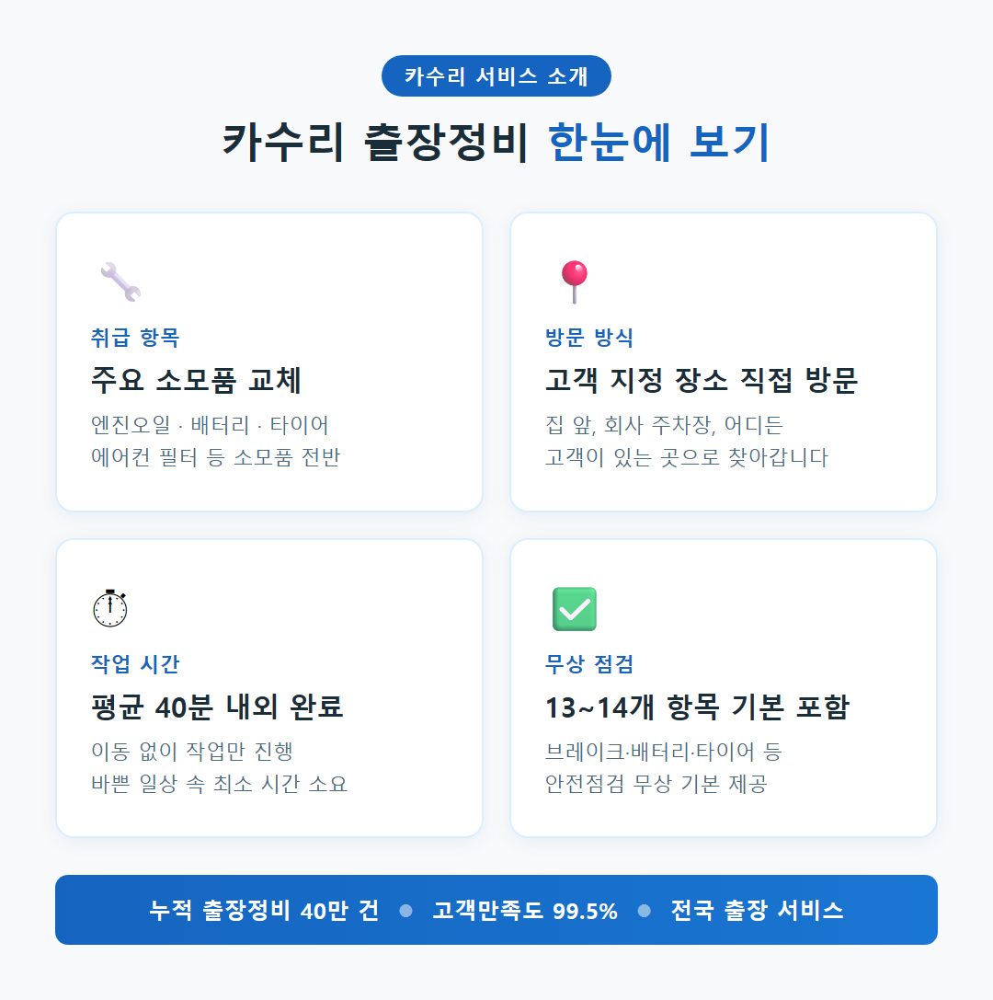
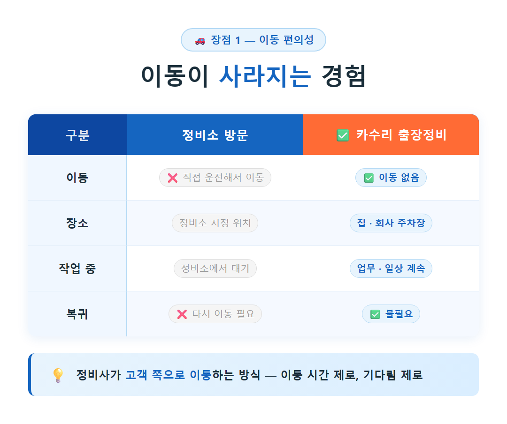
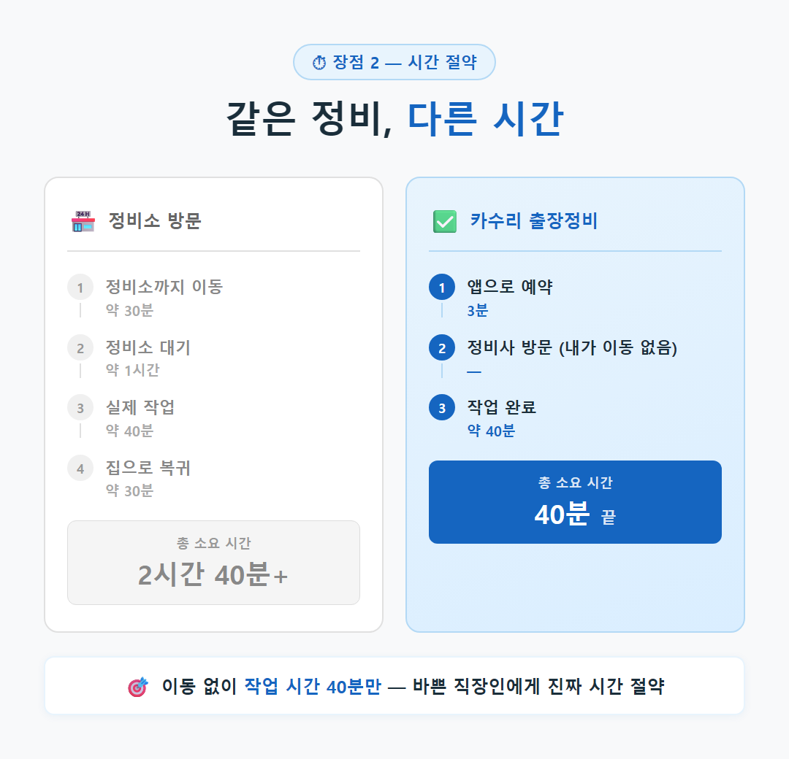
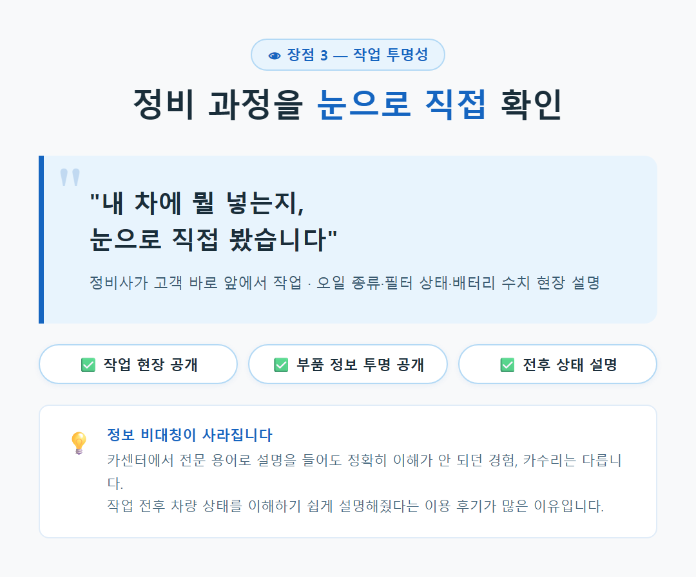
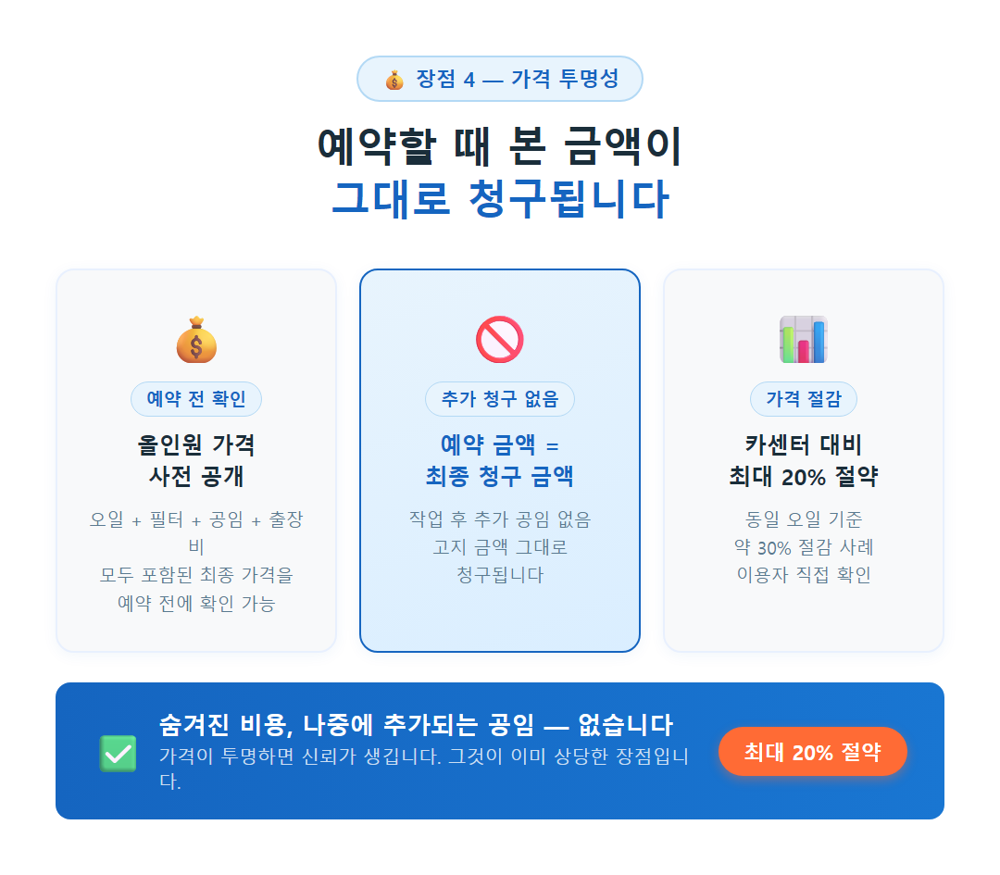
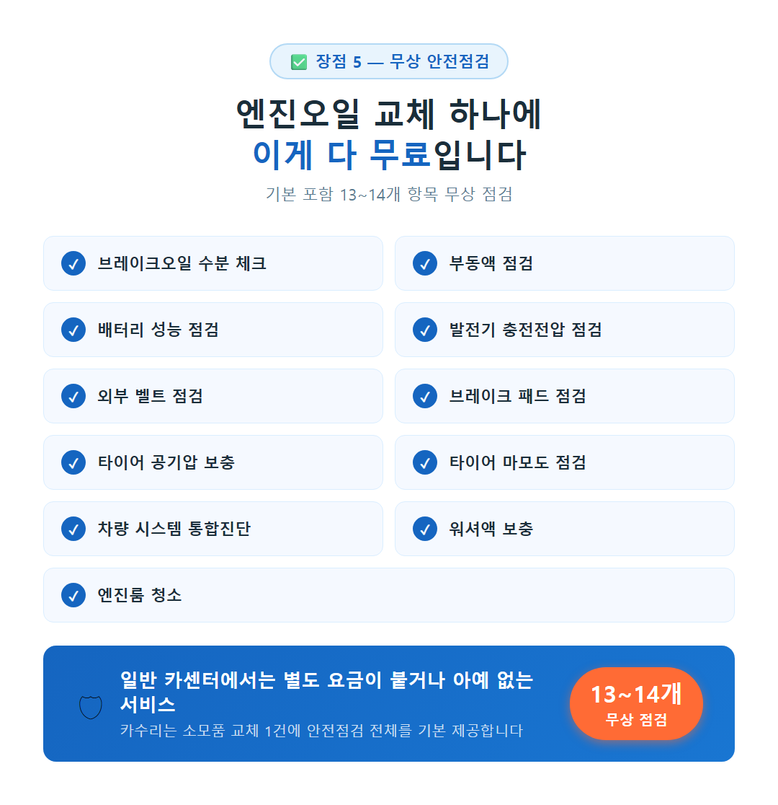

# 카수리 출장정비가 정비소 방문보다 좋은 점 5가지

---

저는 차 정비를 꽤 귀찮아하는 편입니다. 엔진오일 교체 시기가 지났다는 걸 알면서도 "이번 주말에는 꼭…" 하고 미루다 또 한 달이 지나가는 그런 사람이에요. 그런데 카수리를 쓰고 나서 생각이 달라졌는데요. 집 앞 주차장에서 30분도 안 걸려 정비가 끝나는 경험을 한 번 해보고 나니, 굳이 정비소를 찾아다니던 예전으로는 돌아가기 싫어졌습니다.

카수리는 전문 정비사가 고객이 원하는 장소로 직접 찾아오는 출장 자동차 정비 서비스입니다. 엔진오일, 배터리, 에어컨 필터 교체처럼 소모품 교환을 집이나 회사 주차장에서 바로 처리할 수 있는데요. 지금부터 제가 직접 써보고 느낀 정비소 방문과의 차이를 솔직하게 정리해 드리겠습니다.

---

## ■ 이동 시간이 사라지니 삶이 달라지더라고요

정비소 방문이 번거로운 가장 큰 이유는 결국 '이동'입니다. 가까운 카센터를 찾고, 차를 몰고 가고, 거기서 기다리다 다시 집으로 돌아오는 — 그 전 과정이 하나의 외출이 되어버립니다. 어떤 분들은 대중교통으로 돌아오다 짐까지 들고 고생하기도 하는데요.

카수리는 그 구조 자체를 뒤집습니다. 정비사가 고객 쪽으로 이동하는 방식이라서, 저는 회사 주차장에 차를 세워둔 채 업무를 보다가 '완료됐습니다' 문자를 받으면 됩니다. 이동 시간 제로. 확실히 다릅니다.

---

## ■ 40분이면 충분합니다 — 진짜 시간 절약이 무엇인지 알았습니다

정비소를 가보신 분은 아실 겁니다. 이동 30분, 대기 1시간, 작업 40분, 복귀 30분. 가볍게 반나절이 날아갑니다. 수입차 딜러 서비스센터의 경우에는 예약 자체를 잡는 데만 일주일 이상 걸리는 경우도 허다한데요.

카수리의 평균 작업 시간은 약 40분 내외입니다. 이동이 없으니 그 40분이 전부입니다. '집 앞에서 30분도 안 걸려 오일 교체가 완료됐다'는 이용 후기가 많은 것도 무리가 아닌데요. 바쁜 직장인에게 '시간 절약'이라는 말이 이렇게 체감될 수 있구나 싶었습니다.

---

## ■ 내 차에 뭘 넣는지, 눈으로 직접 보게 됩니다

솔직히 말씀드리면, 저는 카센터에서 "이게 필요합니다"라는 말을 들으면 반쯤 믿으면서도 속으로 '진짜 필요한 건지 모르겠다'는 생각을 했습니다. 전문 용어로 설명을 들어도 정확히 이해가 안 되고, 그냥 고개를 끄덕이는 식이었는데요.

카수리는 정비사가 고객 바로 앞에서 작업합니다. 어떤 오일을 쓰는지, 필터 상태가 어떤지, 배터리 성능 수치가 어떤지 — 전부 눈앞에서 설명을 들으며 확인할 수 있습니다. '작업 전후 차량 상태를 이해하기 쉽게 설명해줬다'는 이용 후기가 많은 이유가 여기 있습니다. 정보 비대칭이 사라지는 경험, 생각보다 크게 다가옵니다.

---

## ■ 예약할 때 본 금액이 그대로 청구됩니다

카센터 요금이 불투명하다는 이야기, 한 번쯤 들어보셨을 겁니다. 같은 수리인데 정비소마다 가격이 수십만 원씩 차이 나는 경우도 있고, 작업이 끝난 후 "이것저것 하다 보니 이만큼 됐습니다"라는 말을 듣고 당황한 경험을 가진 분들도 적지 않은데요.

카수리는 예약 전에 앱이나 웹사이트에서 엔진오일·필터·공임·출장비가 모두 포함된 최종 가격을 미리 확인할 수 있습니다. 예약 시 고지된 금액이 그대로 청구됩니다. 추가 공임이 없습니다. '공식적으로 최대 20% 절약'이라는 홍보 문구를 쓰고 있고, 실제 동일 오일 기준 카센터 대비 약 30% 저렴했다는 이용자 보고도 있습니다. 가격이 투명하면 신뢰가 생깁니다. 그것이 이미 상당한 장점입니다.

---

## ■ 오일 교체 하나에 13가지 점검이 따라옵니다

정비소에서 엔진오일만 교체하면 정말 엔진오일만 교체하고 끝나는 경우가 많습니다. 타이어 공기압이 빠져 있어도, 워셔액이 바닥나도 "그건 따로 요청하셔야 합니다"라는 식인데요.

카수리는 엔진오일이나 배터리 교체 시 무상으로 13~14개 항목의 안전점검을 기본으로 제공합니다. 브레이크오일 수분 체크, 부동액, 배터리 성능, 발전기 충전전압, 외부 벨트, 브레이크 패드, 타이어 공기압 보충, 타이어 마모도, 차량 시스템 통합진단, 워셔액 보충, 엔진룸 청소까지 — 일반 카센터에서는 별도 요금이 붙거나 아예 제공하지 않는 서비스들입니다. '엔진오일뿐 아니라 타이어 공기압, 룸 청소, 워셔액, 냉각수까지 꼼꼼히 관리해줬다'는 이용 후기가 그 경험을 잘 표현하고 있습니다.

---

딱 한 줄로 정리하면 이것입니다.

카수리 출장정비는 차 정비에서 '이동', '대기', '불확실한 비용', '정보 비대칭'을 한꺼번에 지워버립니다. 누적 출장정비 40만 건, 고객만족도 99.5%라는 숫자가 그 경험을 숫자로 증명하고 있는데요. 아직 한 번도 써보지 않으셨다면, 다음 엔진오일 교체 때 카수리 앱을 한 번 열어보시길 권해 드립니다. 첫 번째 예약이 생각보다 간단할 겁니다.

---

#카수리 #출장정비 #카수리출장정비 #엔진오일교체 #자동차정비 #차량정비 #출장카센터 #카랑 #집앞정비 #자동차관리
